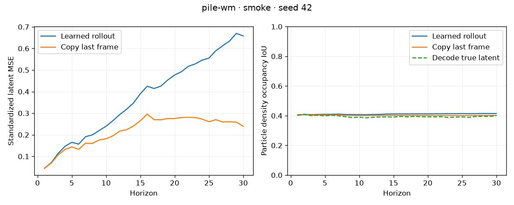
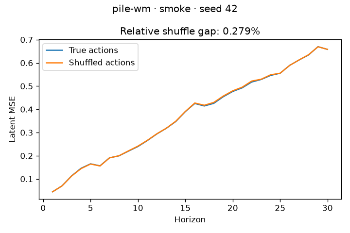
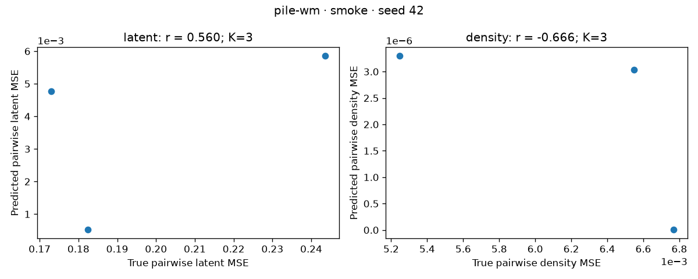
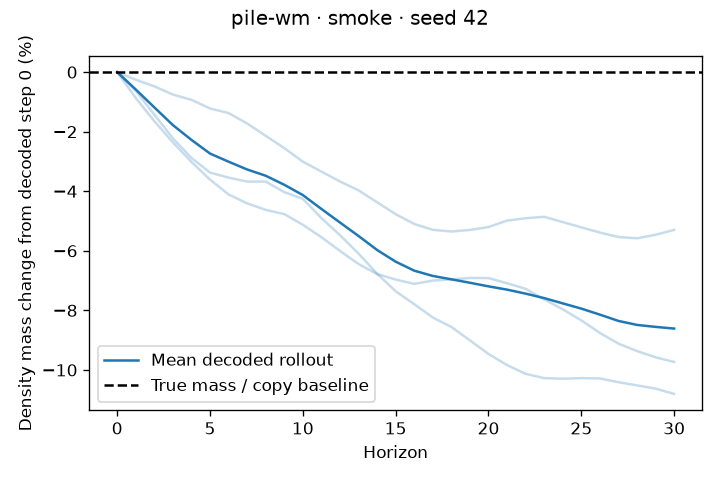
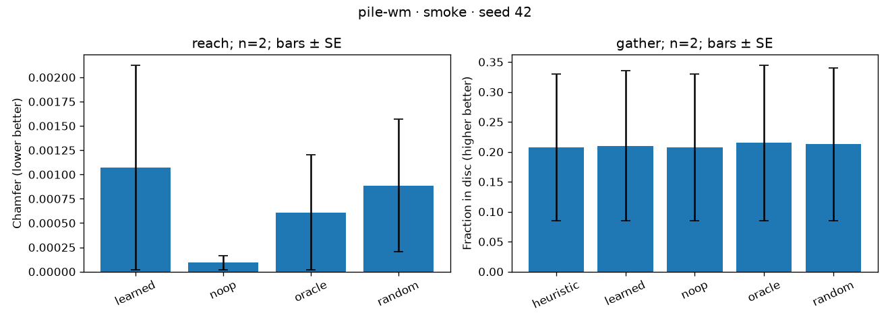
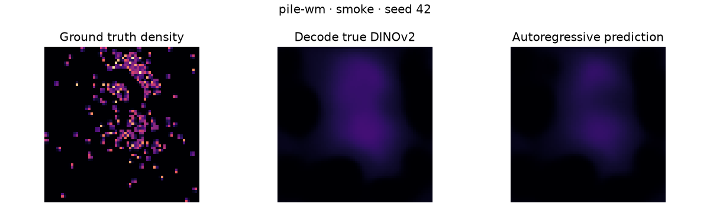
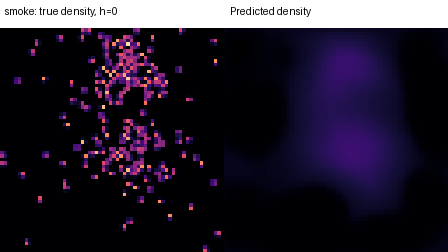
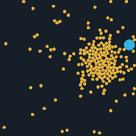

# pile-wm

An action-conditioned latent dynamics research prototype for granular pile pushing, evaluated by rolling out its own predictions and planning in the real simulator.

**Pipeline completion is not evidence of a successful world model.** The measured results below retain failed controls and task outcomes. Unrun configurations are pending.

## Setup

Python 3.11, uv, PyTorch, plain dataclass/YAML configuration, pytest, matplotlib, CSV and local TensorBoard. No accounts or external logging services. Run from the checkout root:

```bash
# Cloud machine has a read-only home; these cache directories are writable.
export UV_CACHE_DIR=/workspace/.cache/uv
export UV_PYTHON_INSTALL_DIR=/workspace/.local/python
export TORCH_HOME=/workspace/.cache/torch
export MPLCONFIGDIR=/workspace/.cache/matplotlib
uv sync --frozen
uv run --frozen pytest -q
```

The official frozen DINOv2 ViT-S/14 checkpoint is downloaded from `dl.fbaipublicfiles.com` over verified HTTPS and checked against its recorded SHA-256. Download failure stops execution; there is no substitute encoder. Unit tests use tiny fixtures and need no network. Auto device selection is CUDA → MPS → CPU. All experiments are seeded from YAML; deterministic PyTorch algorithms are requested. GPU/MPS behavior remains unverified on this CPU host.

## Run the complete pipeline

```bash
uv run --frozen python -m scripts.pipeline --config configs/smoke.yaml
uv run --frozen python -m scripts.pipeline --config configs/small.yaml
# Explicit opt-in only; not run during development:
uv run --frozen python -m scripts.pipeline --config configs/full.yaml
```

The pipeline runs tests, generates or reuses version/config-matched state-only data, audits every saved state, makes the pushing GIF, trains perception and dynamics, evaluates horizons 1–30, compares planners, and writes every report figure plus `artifacts/<config>/metrics.json`. Add `--regenerate` to force data regeneration. Reuse applies only to simulator states, never cached latents. All training/evaluation stages rerun. The checked-in `reports/<config>/` contains measured metrics and figures; large datasets/checkpoints stay in ignored `artifacts/`. CSV and TensorBoard logs are local.

### Budget settings (configuration, not measured performance)

| Config | Trajectories × actions | Predictor updates | Decoder updates | Planning episodes per task/policy | MPC steps |
| --- | ---: | ---: | ---: | ---: | ---: |
| smoke | 32 × 40 | 4 | 20 | 2 | 3 |
| small | 500 × 40 | 2000 | 1000 | 50 | 20 |
| full | 5000 × 40 | 20000 | 3000 | 50 | 20 |

Smoke is a short CPU integration run, not a trained policy benchmark. Small/full use at least 50 episodes with paired starts and report sample standard errors. No full run is launched implicitly.

## Stage entry points

Use the same `--config` argument for each stage:

```bash
uv run --frozen python -m scripts.random_push --config configs/smoke.yaml
uv run --frozen python -m scripts.generate_data --config configs/smoke.yaml
uv run --frozen python -m scripts.validate_data --config configs/smoke.yaml
uv run --frozen python -m scripts.train_decoder --config configs/smoke.yaml
uv run --frozen python -m scripts.train_model --config configs/smoke.yaml
uv run --frozen python -m scripts.evaluate --config configs/smoke.yaml
uv run --frozen python -m scripts.plan --config configs/smoke.yaml
uv run --frozen python -m scripts.report --config configs/smoke.yaml
```

`report` redraws the latest complete pipeline metrics. `scripts.check_encoder` is a separate real-checkpoint integration check. `uv run tensorboard --logdir artifacts/smoke/tensorboard` opens local training logs if a desktop is available.

## Method and metric definitions

The batched PyTorch simulator uses overdamped position-based disc contacts, wall clamping, small pusher substeps, and independently converged environments. Each trajectory stores 200 particle positions, pusher positions, and 40 actions; RGB is rendered on demand. Splits are disjoint trajectory IDs. Correlated random actions reflect momentum at walls.

Frozen DINOv2 supplies 16×16×384 patch tokens. Channel statistics use only seeded training-frame samples. A six-layer, 384-wide frame-causal transformer embeds each outgoing action onto every token of its frame, attends freely within that frame, and uses the last three frames. Loss combines teacher-forced latent MSE and a differentiable three-step self-rollout. The separate convolutional decoder detaches its input and predicts 64×64 count density and a pusher heatmap; its gradients cannot train dynamics.

Evaluation compares autonomous latent MSE and particle-density IoU against copy-last-frame for every horizon 1–30. Occupancy threshold is fixed at 0.1 count units. Decode-true-latent IoU exposes decoder limitations. Action shuffle uses a cyclic batch derangement and a declared 5% relative error gap. Counterfactuals share one held-out start and branch into K action sequences; latent and particle-density pairwise divergence correlations are separate. Undefined zero-variance correlations are null, never passing. Mass drift is decoded particle mass relative to decoded step 0; true mass is constant.

CEM/MPC minimizes final standardized latent MSE to the encoded goal. Learned costs access only predicted latents; oracle costs simulate candidates and encode their final images using the identical cost. Physical scores are computed solely from actual simulator states. Reach uses hidden random sequences and symmetric mean Euclidean Chamfer. Gather uses a nonoverlapping central hexagonal disc packing and the fraction of particle centers in that disc. The scripted gather policy approaches an outer particle from behind and pushes inward. The goal pusher is parked at (0.5,0.95), so latent cost also reflects pusher pose. Reach success requires Chamfer ≤ particle radius and at least 50% improvement from the start; gather success requires fraction ≥ 0.8. Success thresholds do not alter the reported raw metrics.

## Measured results

| Config | Status | Tests | Total seconds | Data reused | World-model competence demonstrated |
| --- | --- | ---: | ---: | --- | --- |
| smoke | Complete pipeline | 19 | 94.8057 | True | False |
| small | Pending; unrun | — | — | — | Unverified |
| full | Pending; unrun | — | — | — | Unverified |

Previous completed **smoke** runs (same resolved configuration):

| Total seconds | Data reused | Tests passed |
| ---: | --- | ---: |
| 181.314 | False | 17 |

### smoke

[Raw metrics](reports/smoke/metrics.json), including resolved configuration, source hashes, stage timing, per-episode outcomes and standard errors.

Mean horizon-1–30 latent MSE: learned **0.372051**, copy **0.216654**. Beats copy: **False**. Action-shuffle relative gap: **0.279078%**; passes declared threshold: **False**.

Counterfactual correlation: latent **0.560351**, particle density **-0.666483**. Final-horizon density IoU: **0.414693**, decode-true-latent IoU: **0.400845**. Final decoded mass drift: **-8.61051%**.

Simulator audit: 1280 transitions, maximum penetration 0.00012378 against tolerance 0.0005. Predictor parameters: 11,191,680. Online encoding took 2.68905 seconds versus 9.32433 seconds for predictor optimization; latent cache used: False.

| Task | Policy | True-state metric ± SE | Seconds/episode ± SE | Success rate |
| --- | --- | ---: | ---: | ---: |
| reach | learned | 0.00107258 ± 0.00105464 | 3.66508 ± 0.395798 | 0.5 |
| reach | noop | 9.14177e-05 ± 7.3475e-05 | 0.067419 ± 0.00409301 | 0.5 |
| reach | oracle | 0.000610541 ± 0.000592599 | 1.82777 ± 0.560818 | 0.5 |
| reach | random | 0.000887103 ± 0.000684575 | 0.170547 ± 0.107316 | 0 |
| gather | heuristic | 0.2075 ± 0.1225 | 0.0673359 ± 0.000963122 | 0 |
| gather | learned | 0.21 ± 0.125 | 3.41357 ± 0.160102 | 0 |
| gather | noop | 0.2075 ± 0.1225 | 0.057264 ± 0.00858275 | 0 |
| gather | oracle | 0.215 ± 0.13 | 1.90565 ± 0.56667 | 0 |
| gather | random | 0.2125 ± 0.1275 | 0.167394 ± 0.126592 | 0 |

All rows above use **smoke**, 2 episodes per task/policy. Reach is lower-better; gather is higher-better. Episode times include controller queries, observations and real steps, but exclude shared goal construction and model loading. Planning advantage demonstrated: **False**.

















## Interpretation and next work

The short smoke run is not evidence that the model qualifies as a successful world model. Check the copy baseline, action shuffle, counterfactual particle-density correlation, decoder reconstruction, and physical planning outcomes together. Tiny reach motions make no-op competitive; two smoke episodes do not establish a planning advantage. Finite CEM budgets and latent/physical cost mismatch can also limit the oracle. No metric or threshold was tuned to conceal a failure.

Next: run the documented small training budget on a GPU, improve decoder reconstruction and action-sensitive dynamics using training/validation data, then rerun unchanged held-out metrics and all paired planner baselines. GPU/MPS execution, small/full efficacy, and 50-episode uncertainty estimates remain unverified until those runs exist. Conditional flow matching is intentionally deferred until milestones 1–6 pass the empirical checks.

See [DECISIONS.md](DECISIONS.md) for choices and failed experiments, and [AGENTS.md](AGENTS.md) for repository conventions.
